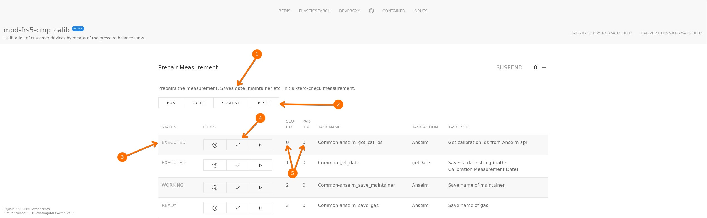

# frontend description

## glosary

**mpd** ... measurement program definition: JSON document stored in
CouchDB defining the steps for a calibration or measurement.

**container** ... part of a mpd that groups measurement sequences.

**task** ... description of a single measurement step. The kind of
task is defined by the _Action_ (e.g. _wait_, _TCP_ or _runMp_).

## overview

1. id of the mpd
2. status of the mpd (_active_ means ready to run)
3. description of the mpd
4. container title
5. container status:
* READY ... container is ready to start
* RUN ... container is running; the tasks of the container are being
  executed
* ERROR ... a task of the container returned an ERROR, task execution
  is interrupted
* MON ... container runs constantly (e.g. monitoring measurements,
  restarts if all tasks in the container are executed)
* SUSPEND ... execution of container tasks is stopped at point
6. number of the container
7. show/hide container content

## container content
 

1. container description
2. container controls:
* RUN ... starts the execution of the tasks in the container
* STOP ... stops the execution of the tasks in the container, the
  status of **all** tasks will be set to READY
* CYCLE ... starts the execution of the tasks in the container,
  **restarts** if all tasks in the container are executed
* SUSPEND ... suspends the execution of the container tasks at point,
  resume with RUN
* RESET ... sets all container tasks to READY status
3. state of measurement step (task):
* READY ... step is ready to be started
* WORKING ... task is running
* EXECUTED ... step is finished; if all tasks in a container have the
  state EXECUTED the
  [scheduler](components/scheduler/src/metis/scheduler/core.clj) sets
  all steps to READY
* ERROR ... an error occured during the execution of the task; the  
  [scheduler](components/scheduler/src/metis/scheduler/core.clj) sets
  the container status to ERROR; the execution is suspended
3. task controls:
* [ ⚙ ] ... set state of step to WORKING: stops the execution until step is set to READY or EXECUTED
* [ ✓ ] ... set state of step to EXECUTED: task execution is skipped 
* [ ▷ ] ... set state of step to READY: run task again (e.g. after error)
