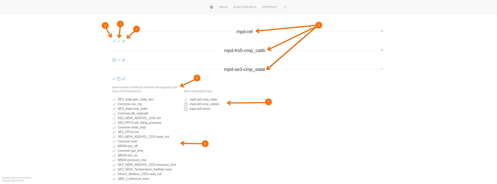

# front end description

## glossary

**_mpd_** ... measurement program definition: JSON document stored in
CouchDB defining the steps for a calibration or measurement.

**container** ... part of a _mpd_ that groups a measurement sequence.

**_task_** ... description of a single measurement step. The kind of
_task_ is defined by the _Action_ (e.g. _wait_, _TCP_ or _runMp_).

## _mpd_ overview

1. id of available _mpd_
2. all _task_s needed for the _mpd_ are available: 
* ✓ ... yes
* ! ... no
3. Most _mpds_ depend on measurement sequences provided by other _mpds_;
   are these available:
* ✓ ... yes
* ! ... no
4. link to the container view of the _mpd_ The view containing

5., 6. and 7. are available after click on 1 (id of the _mpd_) or + sign
at the end of the line.

5. description of the _mpd_ 
6. detailed list of the used/needed _task_s
7. detailed list of the used/needed _mpds_

## container overview

1. id of the _mpd_
2. status of the _mpd_ (_active_ means ready to run)
3. description of the _mpd_
4. container title
5. container status:
* READY ... container is ready to start
* STOP ... container was stooped and is ready to start
* RUN ... container is running; the _task_s of the container are being
  executed
* ERROR ... a _task_ of the container returned an ERROR, _task_ execution
  is interrupted
* MON ... container runs constantly (e.g. monitoring measurements) 
  restarts if all _task_s in the container are executed
* SUSPEND ... execution of container _task_s is stopped at point
6. number of the container
7. show/hide container content
8. ids of the calibration or measurement documents in which the data
   is stored. Empty after page reload (gets data on changes of 
   the ids interface). 

## container content
 

1. container description
2. container controls:
* RUN ... starts the execution of the _task_s in the container
* CYCLE ... starts the execution of the _task_s in the container,
  **restarts** if all _task_s in the container are executed
* SUSPEND ... suspends the execution of the container _task_s at point
  (resume with RUN, set all steps back to ready with RESET)
* RESET ... sets all container _task_s to READY status
3. state of measurement step (_task_):
* READY ... step is ready to be started
* WORKING ... _task_ is running
* EXECUTED ... step is finished; if all _task_s in a container have the
  state EXECUTED the
  [scheduler](components/scheduler/src/metis/scheduler/core.clj) sets
  all steps to READY
* ERROR ... an error occurred during the execution of the _task_; the  
  [scheduler](components/scheduler/src/metis/scheduler/core.clj) sets
  the container status to ERROR; the execution is suspended

4. _task_ controls:
*  ⚙ ... set state of step to WORKING: stops the execution until step
   is set to READY or EXECUTED
*  ✓ ... set state of step to EXECUTED: _task_ execution is skipped
*  ▷ ... set state of step to READY: run _task_ again (e.g. after error)
5. _task_ position : 
* SEQ-IDX ... sequential step index and 
* PAR-IDX ... parallel step index.

SEQ-IDX and PAR-IDX together with the container number (internal name
NO-IDX) unambiguously address a _task_ or step in an _mpd_.
