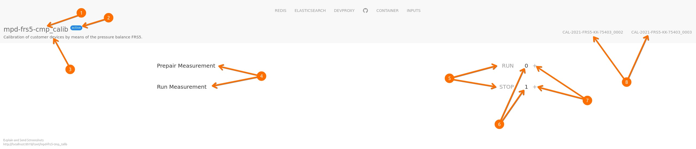

# frontend description

## glosary

**mpd** ... measurement program definition: JSON document stored in
CouchDB defining the steps for a calibration or measurement.

## overviev

1. id of the mpd
2. status of the mpd: ⚡ means _active_ (ready to run)
